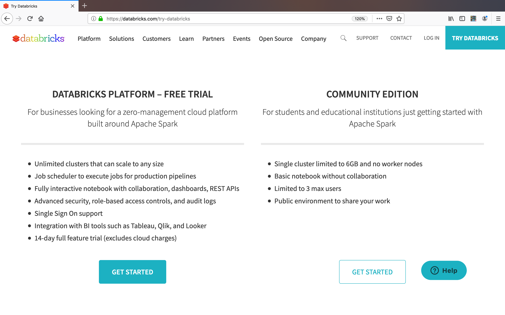
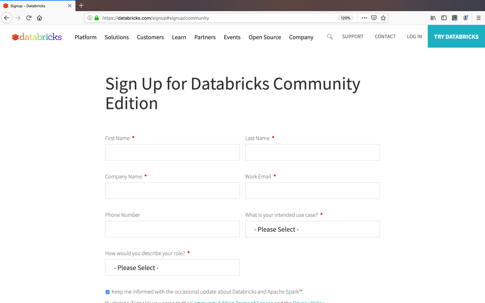
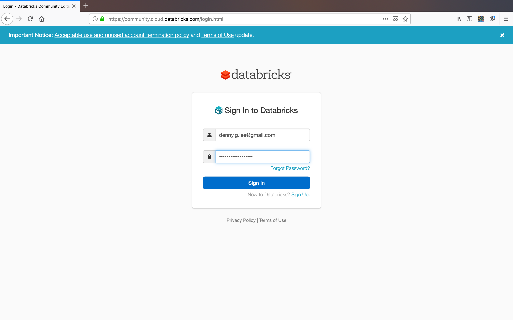
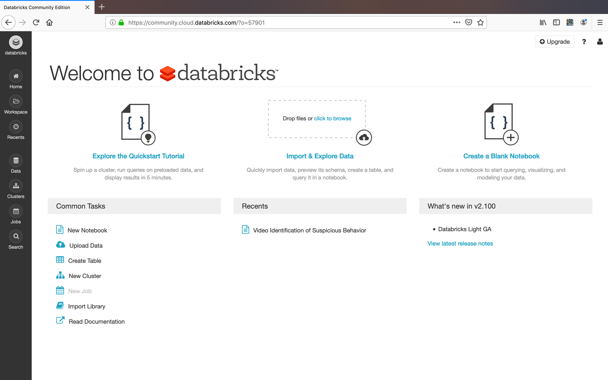

# Delta Lake Tutorial: Spark + AI Summit 2019 EU

### Sign Up for Databricks Community Edition

Expand to view more details about Databricks Community Edition

  
Start by signing up for **Databricks Community Edition** by going to [databricks.com/try](https://databricks.com/try) and choose *Community Edition*.  

Note, the **Community Edition** link is on the right side with the *white* **Get Started** button (i.e. *not* the green button).   This is a free edition of Databricks and does not require your credit card.  

Next, sign up for **Databricks Community Edition (DBCE)** by filling out the form (note, no credit card is required).  Once you sign up, verify your account by going to your email account that you filled out in the preceding form.  Once your account is validated, go to DBCE which should look similar to below.

Once you log in, you will view the Databricks workspace similar to the screenshot below.

### Import Notebook

Expand to view more details about Importing Notebooks

For these next steps, we will import the following notebook so keep the following link(s) handy:

| Notebook                       | Notebook Link                                          |
| ------------------------------ | ------------------------------------------------------ |
| 01 - Delta Lake Primer         | [https://dbricks.co/dlw-01](https://dbricks.co/dlw-01) |
| 02 - Delta Lake + ML           | [https://dbricks.co/dlw-02](https://dbricks.co/dlw-02) |
| 03 - Delta Lake + ML (XGBoost) | [https://dbricks.co/dlw-03](https://dbricks.co/dlw-03) |

Start by opening up one of the notebooks in the preceding link.   Click on the **Import Notebook** on the top right of the window. 

It will open up the **Import Notebook** dialog similar to the screenshot below.

Copy the notebook URL.

Then go back to your workspace, *right click* and then choose **Import**.

This will open up the *Import Notebooks* dialog in the Databricks workspace.  

Paste the notebook URL you had copied from two screens prior into the *Import Notebooks* dialog.

Once you have imported the notebook, your screen should similar to the view below.  In the case of the *Delta Lake Primer* notebook, the three errors you are seeing on the right side are *by design*.  

### Create a cluster with Databricks Runtime 6.1
